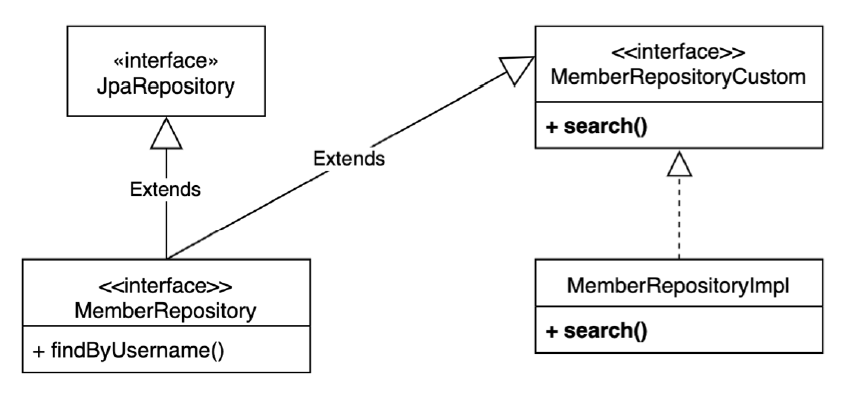

[인프런] 실전! Querydsl

## 1. 프로젝트 환경설정

### 1.1 Querydsl 설정과 검증

- [SpringBoot 3.0이상 설정 참고 - compileQuerydsl 오류 발생 시](https://www.inflearn.com/questions/355723/compilequerydsl-%EC%98%A4%EB%A5%98)
- [[gradle] 그레이들 Annotation processor 와 Querydsl](http://honeymon.io/tech/2020/07/09/gradle-annotation-processor-with-querydsl.html)

<aside>
📌 버전 문제로 강의 소스와 내 build.gradle 코드 다름 주의

</aside>

### 1.2 스프링 부트 설정 - JPA, DB

- application.yml에서
콘솔로그 설정은
`spring.jpa.properties.hibernate.format_sql` 이고
파일 로그 설정은
`logging.level.org.hibernate.SQL`
- `logging.level.org.hibernate.type: trace` 로 파라미터를 확인할 수 있지만 가독성이 떨어져 p6spy 라이브러리 이용
- **스프링부트 3.0이상부터 p6spy 사용 위해 build.gradle 외에 2가지 추가 설정 필요**
    - (1) src/main/resources/META-INF/spring/com.github.gavlyukovskiy.boot.jdbc.decorator.DataSourceDecoratorAutoConfiguration
    - (2) src/main/resources/spy.properties
- `spring.jpa.properties.hibernate.use_sql_comments` 옵션으로 JPQL 쿼리 변환 확인

## 2. 기본문법

### 2.1 기본 Q-Type 활용

- Q클래스 인스턴스 활용 2가지 방법
    
    ```java
    QMember qMember = new QMember("m"); //별칭 직접 지정
    QMember qMember = QMember.member;   //기본 인스턴스 사용
    ```
    
    <aside>
    📌 Alias가 자동으로 생성(기본 인스턴스 사용)되지 않아야 하는 경우 별칭 직접 지정 (예: 서브쿼리)
    
    </aside>
    

### 2.2 검색 조건 쿼리

- 검색 조건은 `.and()` , . `or()` 를 메서드 체인으로 연결할 수 있음
- select , from 을 `selectFrom` 으로 합칠 수 있음
- AND 조건을 파라미터로 처리

### 2.3 결과조회

- `fetch()` : 리스트 조회, 데이터 없으면 빈 리스트 반환
- `fetchOne()` : 단 건 조회
    - 결과가 없으면 : null
    - 결과가 둘 이상이면 : com.querydsl.core.NonUniqueResultException
- `fetchFirst()` : limit(1).fetchOne()
- `fetchResults()` : 페이징 정보 포함, total count 쿼리 추가 실행
- `fetchCount()` : count 쿼리로 변경해서 count 수 조회

<aside>
📌 [fetchResults, fetchCount 미지원 관련](https://jjunn93.com/entry/Querydsl-페이징-연동-Querydsl-fetchResults-fetchCount-Deprecated향후-미지원)

</aside>

### 2.4 정렬

- `desc()` , `asc()` : 일반 정렬
- `nullsLast()` , `nullsFirst()` : null 데이터 순서 부여

### 2.5 페이징

- (예시)
    
    ```java
    QueryResults<Member> queryResults = queryFactory
                    .selectFrom(member)
                    .orderBy(member.username.desc())
                    .offset(1)
                    .limit(2)
                    .fetchResults();
    ```
    

### 2.6 집합

### 2.7 기본조인

- 기본 조인
`join(조인 대상, 별칭으로 사용할 Q타입)`
- 세타 조인 (연관관계가 없는 필드로 조인)
from절에 여러 엔티티를 선택해서 세타 조인

### 2.8 조인 - on절

- ON절을 활용한 조인 2가지
    - 조인 대상 필터링
    - 연관관계 없는 엔티티 외부 조인

### 2.9 조인 - 페치조인

- join(), leftJoin() 등 조인 기능 뒤에 fetchJoin() 이라고 추가
    
    ```jsx
    Member findMember = queryFactory
    	.selectFrom(member)
    	.join(member.team, team).fetchJoin()
    	.where(member.username.eq("member1"))
    	.fetchOne();
    ```
    

### 2.10 서브 쿼리

- `com.querydsl.jpa.JPAExpressions` 사용
- JPA JPQL 서브쿼리의 한계점으로 from 절의 서브쿼리(인라인 뷰)는 지원하지 않는다.

<aside>
📌 from 절의 서브쿼리 해결방안

1. 서브쿼리를 join으로 변경한다. (가능한 상황도 있고, 불가능한 상황도 있다.)
2. 애플리케이션에서 쿼리를 2번 분리해서 실행한다.
3. nativeSQL을 사용한다
</aside>

### 2.11 Case문

### 2.12 상수, 문자 더하기

---

## 3. 중급 문법

### 3.1 프로젝션 결과 반환 - 기본

### 3.2 프로젝션 결과 반환 - DTO 조회

- (방법 3가지)
프로퍼티 접근
필드 직접 접근
생성자 사용

### 3.3 프로젝션 결과 반환 - @QueryProjection

<aside>
📌 @QueryProjection을 사용하면 DTO클래스가 순수하지 않고 querydsl 라이브러리를 참조해야되는 단점 발생

</aside>

### 3.4 동적쿼리 - BooleanBuilder 사용

<aside>
📌 동적쿼리 작성할 땐, 아무 조건 없을 때 전체 데이터 조회하는 위험 주의할 것. (페이징 등 추가)

</aside>

### 3.5 동적쿼리 - Where 다중 파라미터 사용

<aside>
📌 * Where안에 파라미터 메서드의 반환형은 `Predicate` 보단 `BooleanExpression` 가 더 나음 ⇒ 컴포지션 가능
* BooleanBuilder보다 Where 방식을 권장

</aside>

### 3.6 수정 삭제 벌크 연산

<aside>
📌 영속성 컨텍스트는 벌크 업데이트 후 동기화 되지 않으므로 초기화 해주는 것이 안전

</aside>

### 3.7 SQL function 호출하기

---

## 4. 실무 활용 - 순수 JPA와 Querydsl

### 4.1 사용자 정의 리포지토리



<aside>
📌 특화된 기능이면 별도의 리포지토리 클래스 작성하는 것이 깔끔. 굳이 커스텀할 필요 X

</aside>

### 4.2 페이징 연동

- SpringData의 Page 인터페이스 구현체인 PageImpl 클래스 활용하여 리턴
- 카운트 쿼리 분리? 한번에?
- `PageableExecutionUtils` 를 이용하여 count 쿼리가 생략 가능한 경우 생략해서 처리
    - 페이지 시작이면서 컨텐츠 사이즈가 페이지 사이즈보다 작을 때
    - 마지막 페이지 일 때 (offset + 컨텐츠 사이즈를 더해서 전체 사이즈 구함)

```java
JPAQuery<Member> countQuery = queryFactory.selectFrom(member)
        .leftJoin(member.team, team)
        .where(
                usernameEq(condition.getUsername()),
                teamNameEq(condition.getTeamName()),
                ageGoe(condition.getAgeGoe()),
                ageLoe(condition.getAgeLoe())
        );
return PageableExecutionUtils.getPage(content, pageable, countQuery::fetchCount);
```

---

## ○ 그 외

- JpaQueryFactory는 필드 레벨로 가져가도 괜찮음. 동시성 문제 없게 설계됨
- JpaQueryFactory는 StartApplication 클래스에 스프링 빈으로 등록하고 주입 받아 사용해도 됨

```java
// QuerydslApplication.java
@Bean
JPAQueryFactory jpaQueryFactory(EntityManager em) {
	return new JPAQueryFactory(em);
}

// MemberJpaRepository.java
public MemberJpaRepository(EntityManager em, JPAQueryFactory queryFactory) {
    this.em = em;
    this.queryFactory = queryFactory;
}
```